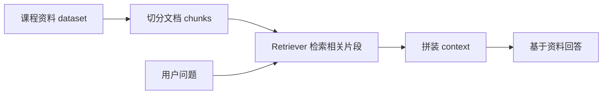

# Baseline RAG Flow

```mermaid
flowchart LR
    A[课程资料 dataset] --> B[切分文档 chunks]
    B --> C[Retriever 检索相关片段]
    D[用户问题] --> C
    C --> E[拼装 context]
    E --> F[基于资料回答]
```

适用章节：
- 第 5 章 RAG 入门
- 第 10 章综合实战中的共享资源说明

教学重点：
- 让学习者先理解最小闭环，而不是一开始引入向量库、Embedding 服务或复杂评测。
