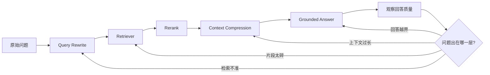

# RAG Optimization Loop

```mermaid
flowchart LR
    A[原始问题] --> B[Query Rewrite]
    B --> C[Retriever]
    C --> D[Rerank]
    D --> E[Context Compression]
    E --> F[Grounded Answer]
    F --> G[观察回答质量]
    G --> H{问题出在哪一层?}
    H -->|检索不准| B
    H -->|片段太碎| C
    H -->|上下文过长| E
    H -->|回答越界| F
```

适用章节：
- 第 6 章 RAG 进阶优化
- 第 9 章调试与观测
- 第 10 章综合实战

教学重点：
- 强调 RAG 调优不是只换模型，而是对检索链路各层逐步定位与回放。
